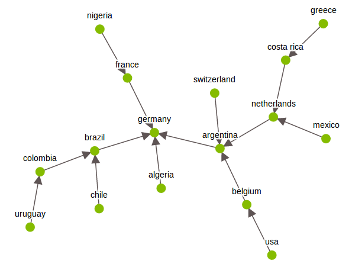

# Find the connected components

In the SGraph exercises in chapter 1 we analyzed results from the group stage of
the 2014 World Cup. Now find the connected components for the graph of 2014
World Cup knockout stage results. The data---again from the FIFA website---are
listed below. As with the group stage, vertices represent teams and edges point
from the losing team to the winning team.

<span style="color:red">**Question 1:**</span>
First summarize and visualize the new graph.

```python
countries = {
    'argentina': 'south america',
    'switzerland': 'europe' ,
    'france': 'europe',
    'greece': 'europe',
    'netherlands': 'europe',
    'costa rica': 'north america',
    'algeria': 'africa',
    'belgium': 'europe',
    'brazil': 'south america',
    'colombia': 'south america',
    'nigeria': 'africa',
    'usa': 'north america',
    'germany': 'europe',
    'chile': 'south america',
    'mexico': 'north america',
    'uruguay': 'south america'}

results = [
    ('chile', 'brazil', 'belo horizonte'),
    ('uruguay', 'colombia', 'rio de janeiro'),
    ('nigeria', 'france', 'brasilia'),
    ('algeria', 'germany', 'porto alegre'),
    ('mexico', 'netherlands', 'fortaleza'),
    ('greece', 'costa rica', 'recife'),
    ('switzerland', 'argentina', 'sao paulo'),
    ('usa', 'belgium', 'salvador'),
    ('colombia', 'brazil', 'fortaleza'),
    ('france', 'germany', 'rio de janeiro'),
    ('costa rica', 'netherlands', 'salvador'),
    ('belgium', 'argentina', 'brasilia'),
    ('brazil', 'germany', 'belo horizonte'),
    ('netherlands', 'argentina', 'sao paulo'),
    ('argentina', 'germany', 'rio de janeiro')]
```

```python
verts = graphlab.SFrame({'name': countries.keys(),
                         'continent': countries.values()})

losers, winners, locations = zip(*results)
edges = graphlab.SFrame({'loser': list(losers),
                         'winner': list(winners),
                         'location': list(locations)})

sg = graphlab.SGraph()
sg = sg.add_vertices(verts, vid_field='name')
sg = sg.add_edges(edges, src_field='loser', dst_field='winner')
print sg.summary()
sg.show(vlabel='id', arrows=True, ewidth=1.5)
```
```no-highlight
{'num_edges': 15, 'num_vertices': 16}
```




A [connected
component](http://en.wikipedia.org/wiki/Connected_component_%28graph_theory%29)
of a graph is a subgraph where every pair of nodes is connected by *some* path
through the component. For two nodes in *different* connected components there
is no path between them.

The component assignment for each vertex is returned in both the 'componentid'
and 'graph' objects. The former is an SFrame, while the 'graph' object is an
SGraph whose vertices have an attribute with the answer. The following are
equivalent ways to get the answer.


<span style="color:red">**Question 2:**</span>
How many connected components are there?

Because all countries are connected via the knockout stage results, there is
only one giant connected component.

```python
cc = graphlab.connected_components.create(sg)
print "number of components:", cc['component_size'].num_rows()
```
```no-highlight
number of components: 1
```
