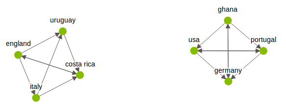
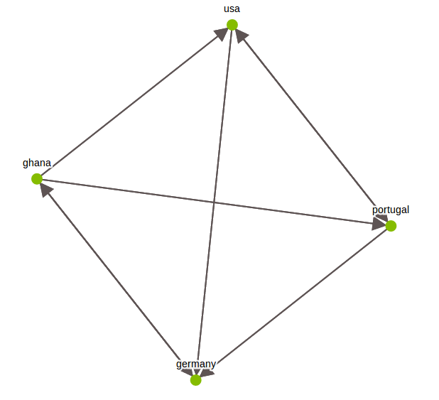

# Creating an SGraph

For the following SGraph exercises, we'll use the countries and results from two
groups in the 2014 World Cup to explore SGraph construction, summarization,
visualization, and filtering. To model this kind of data as a graph, we'll
represent countries by vertices and game outcomes by directed edges. The source
vertex for each edge is the losing team, and the destination vertex is the
winning team. Ties are represented by including edges in both directions.

The following data was transcribed from the
[FIFA website](http://www.fifa.com/worldcup/matches/index.html).

```python
countries = {
    'usa': 'G',
    'ghana': 'G',
    'germany': 'G',
    'portugal': 'G',
    'england': 'D',
    'italy': 'D',
    'costa rica': 'D',
    'uruguay': 'D'}

results = [
    ('portugal', 'germany'),
    ('ghana', 'usa'),
    ('portugal', 'usa'),
    ('usa', 'portugal'),
    ('usa', 'germany'),
    ('ghana', 'portugal'),
    ('ghana', 'germany'),
    ('germany', 'ghana'),
    ('england', 'italy'),
    ('england', 'uruguay'),
    ('england', 'costa rica'),
    ('costa rica', 'england'),
    ('uruguay', 'costa rica'),
    ('italy', 'costa rica'),
    ('italy', 'uruguay')]
```

<span style="color:red">**Question 1:**</span>

Construct [SFrames](https://dato.com/products/create/docs/generated/graphlab.SFrame.html#graphlab.SFrame) for the vertex and edge data.

```python
verts = graphlab.SFrame({'name': countries.keys(),
                         'group': countries.values()})
print verts
```
```no-highlight
+-------+------------+
| group |    name    |
+-------+------------+
|   G   |   ghana    |
|   G   |  germany   |
|   G   |  portugal  |
|   G   |    usa     |
|   D   |  uruguay   |
|   D   |  england   |
|   D   |   italy    |
|   D   | costa rica |
+-------+------------+
[8 rows x 2 columns]
```

```python
losers, winners = zip(*results)
edges = graphlab.SFrame({'loser': list(losers),
                   'winner': list(winners)})
print edges
```
```no-highlight
+----------+----------+
|  loser   |  winner  |
+----------+----------+
| portugal | germany  |
|  ghana   |   usa    |
| portugal |   usa    |
|   usa    | portugal |
|   usa    | germany  |
|  ghana   | portugal |
|  ghana   | germany  |
| germany  |  ghana   |
| england  |  italy   |
| england  | uruguay  |
|   ...    |   ...    |
+----------+----------+
[15 rows x 2 columns]
```

<span style="color:red">**Question 2:**</span>
Make an empty [SGraph](https://dato.com/products/create/docs/generated/graphlab.SGraph.html#graphlab.SGraph).


```python
sg = graphlab.SGraph()
```

<span style="color:red">**Question 3:**</span>
Add the vertices and edges to the graph.

```python
sg = sg.add_vertices(verts, vid_field='name')
sg = sg.add_edges(edges, src_field='loser', dst_field='winner')
```


##### Summarize and visualize the graph

<span style="color:red">**Question 4:**</span>
Summarize the graph. How many vertices and eges are there?

The [summary](https://dato.com/products/create/docs/generated/graphlab.SGraph.summary.html#graphlab.SGraph.summary) method gives the number of vertices and
edges in the graph, which is often the best place to start.

```python
print sg.summary()
```
```no-highlight
{'num_edges': 15, 'num_vertices': 8}
```


<span style="color:red">**Question 5:**</span>
Show the graph. Highlight the teams from North America, and use arrows to
indicate the winner of each match.

```python
sg.show(arrows=True, vlabel='id')
```



<span style="color:red">**Question 6:**</span>
Extract the vertices and edges as SFrames. Do the numbers of rows and edges
match the summary?

The graph's SFrames for vertices and edges show there are indeed 8 vertices
(with a 'group' attribute) and 15 edges (with no attributes).

```python
sf_vert = sg.vertices
print sf_vert
```
```no-highlight
+------------+-------+
|    __id    | group |
+------------+-------+
|   ghana    |   G   |
| costa rica |   D   |
|  portugal  |   G   |
|    usa     |   G   |
|  england   |   D   |
|  germany   |   G   |
|   italy    |   D   |
|  uruguay   |   D   |
+------------+-------+
[8 rows x 2 columns]
```

```python
sf_edge = sg.edges
print sf_edge
```
```no-highlight
+------------+------------+
|  __src_id  |  __dst_id  |
+------------+------------+
|   ghana    |  portugal  |
|   ghana    |    usa     |
|   ghana    |  germany   |
| costa rica |  england   |
|  portugal  |    usa     |
|  portugal  |  germany   |
|    usa     |  portugal  |
|    usa     |  germany   |
|  germany   |   ghana    |
|  england   | costa rica |
|    ...     |    ...     |
+------------+------------+
[15 rows x 2 columns]
```


##### Filter the vertices

<span style="color:red">**Question 7:**</span>
Extract only the vertices in group H and plot the subgraph.

There are a couple ways to do this. The [get_vertices](https://dato.com/products/create/docs/generated/graphlab.SGraph.get_vertices.html#graphlab.SGraph.get_
vertices) command is the most straightforward, but filtering on the underlying
SFrame is more flexible.

```python
sub_verts = sg.vertices[sg.vertices['group'] == 'G']  # option 1
sub_verts = sg.get_vertices(fields={'group': 'G'})  # option 2
print sub_verts
```
```no-highlight
+----------+-------+
|   __id   | group |
+----------+-------+
|  ghana   |   G   |
| portugal |   G   |
|   usa    |   G   |
| germany  |   G   |
+----------+-------+
[4 rows x 2 columns]
```


To materialize the subgraph, construct a new SGraph and add the edges of
subgraph.

```python
subgraph = graphlab.SGraph()
subgraph = subgraph.add_edges(sg.get_edges(src_ids=sub_verts['__id']))
print subgraph.summary()
```
```no-highlight
{'num_edges': 8, 'num_vertices': 4}
```

```python
subgraph.show(vlabel='id', arrows=True, ewidth=2)
```



##### Compute vertex degree

The *in-degree* of a vertex is the number of edges that point to the vertex, the
*out-degree* is the number of edges that point out from the vertex, and the
*degree* is the sum of these two. In the context of our World Cup example, the
in-degree is the number of wins and ties, and the degree is the total number of
games for a given team. In this set of exercises, we'll use triple apply to
compute the in-degree of each vertex. For more on vertex degree, check out
the [Wikipedia article](http://en.wikipedia.org/wiki/Degree_%28graph_theory%29).

<span style="color:red">**Question 8:**</span>
Define a function to increment the degree counts for an arbitrary
source-edge-destination triple. This function should simply add 1 to the
*degree* field for each of the source and destination vertices.

```python
def increment_in_degree(src, edge, dst):
    dst['in_degree'] += 1
    return (src, edge, dst)
```


<span style="color:red">**Question 9:**</span>
Create a new vertex field with in-degree set to 0 for each vertex.

Add the 'degree' field to the vertex attributes. Note that adding vertices with
the same id's to the graph does not cause duplicate entries.

```python
sf_vert['in_degree'] = 0
sg = sg.add_vertices(sf_vert)
```


<span style="color:red">**Question 10:**</span>
Use the triple apply function to compute in-degree for all nodes. Which team(s)
did the best in the group stage?

```python
sg = sg.triple_apply(increment_in_degree, mutated_fields=['in_degree'])
print sg.vertices.sort('in_degree', ascending=False)
```
```no-highlight
+------------+-------+-----------+
|    __id    | group | in_degree |
+------------+-------+-----------+
| costa rica |   D   |     3     |
|  germany   |   G   |     3     |
|  portugal  |   G   |     2     |
|    usa     |   G   |     2     |
|  uruguay   |   D   |     2     |
|   ghana    |   G   |     1     |
|  england   |   D   |     1     |
|   italy    |   D   |     1     |
+------------+-------+-----------+
[8 rows x 3 columns]
```

Costa Rica and Germany did the best of these two groups in the group stage. If
this is surprising, don't forget that we counted tie games twice.
